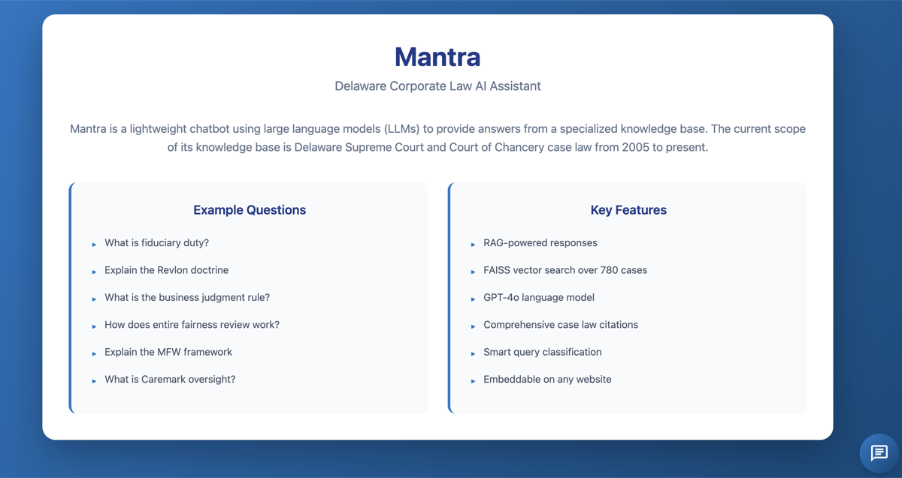
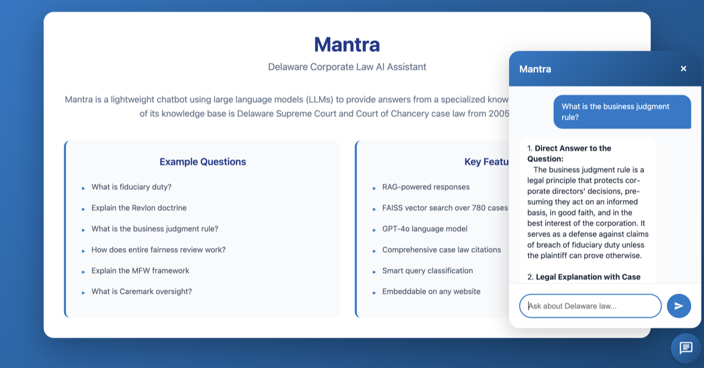
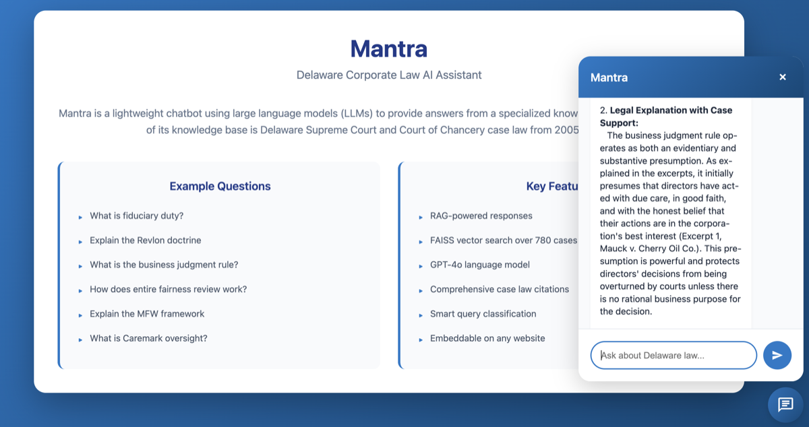
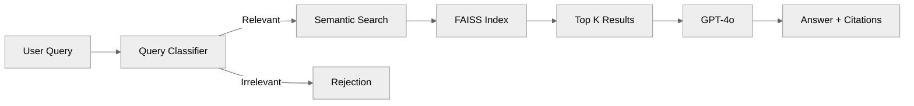
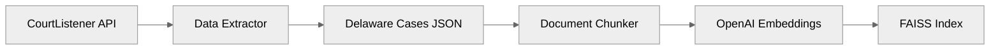

# Mantra - A Lightweight RAG-based Chatbot Service

Mantra is a lightweight chatbot using LLMs and RAG architecture to provide accurate, well-cited answers to questions in the legal domain. The current scope of Mantra covers Delaware case law, corporate governance, and legal standards. However, it can be adjusted to include other legal jurisdictions and topics. 

## Features

- **Query Classification** - Automatically filters irrelevant questions
- **Semantic Search** - FAISS-powered vector search over Delaware case law
- **GPT-4o Responses** - High-quality legal analysis and explanations
- **Source Citations** - Every answer includes case citations
- **Metadata Filtering** - Filter by court, date, and topics


## Demo Screenshots








## Architecture

### Query Pipeline


### Data Pipeline


### Components

1. **Data Extractor** (`data_extractor.py`)
   - Fetches Delaware corporate law cases from CourtListener API
   - Filters by key topics (fiduciary duty, Revlon, Corwin, etc.)
   - Processes and structures case data

2. **Indexer** (`indexer.py`)
   - Intelligent legal document chunking
   - OpenAI embeddings (text-embedding-3-small)
   - FAISS vector index creation
   - Metadata management

3. **Query Classifier** (`query_classifier.py`)
   - Determines query relevance to Delaware law
   - Keyword and LLM-based classification
   - Rejects off-topic questions

4. **Response Generator** (`response_generator.py`)
   - GPT-4o powered answer generation
   - Proper legal citation formatting
   - Confidence scoring

5. **Mantra App** (`mantra_app.py`)
   - Integrated Streamlit application
   - Chat interface
   - Search filters
   - Source display

## Tech Stack

- **Vector DB**: FAISS (IndexFlatL2)
- **Embeddings**: OpenAI text-embedding-3-small
- **LLM**: GPT-4o
- **Framework**: LangChain
- **Backend**: FastAPI
- **UI**: Streamlit & JavaScript Chat Widget
- **Data**: CourtListener API (Delaware cases)

## Prerequisites

- Python 3.8+
- OpenAI API key
- CourtListener API token (optional, for data extraction)

## Installation

### 1. Clone and Install Dependencies

```bash
cd windsurf-project
pip install -r requirements.txt
```

### 2. Configure Environment

```bash
cp .env.example .env
```

Edit `.env` and add your API keys:
```
OPENAI_API_KEY=your-openai-api-key-here
COURTLISTENER_API_TOKEN=your-token-here  # Optional
```

### 3. Extract Case Law Data

```bash
# Test with 10 cases first
python test_extractor.py

# Or extract all Delaware corporate law cases
python data_extractor.py
```

This will create `./data/cases/delaware_cases.json` with case data.

### 4. Build FAISS Index

```bash
# Test with 5 cases
python test_indexer.py

# Or build full index
python indexer.py
```

This creates the FAISS index in `./faiss_index/`.

### 5. Run Mantra

```bash
streamlit run mantra_app.py
```

Open your browser to `http://localhost:8501`

## Usage

### Basic Queries

**Relevant Questions** (will be answered):
- "What is fiduciary duty?"
- "Explain the Revlon doctrine"
- "What is the business judgment rule?"
- "How does entire fairness review work?"
- "What are Section 220 books and records requests?"

**Irrelevant Questions** (will be rejected):
- "Who is Koosha and where does he work?"
- "What's the weather today?"
- "How do I make pasta?"

### Advanced Features

**Source Citations:**
- Every answer includes case citations
- Click "View Source Cases" to see full case details
- Links to original cases on CourtListener

## Project Structure

```
windsurf-project/
├── data_extractor.py          # Component 1: Data acquisition
├── indexer.py                  # Component 2: Document indexing
├── query_classifier.py         # Component 3: Query classification
├── response_generator.py       # Component 4: Response generation
├── mantra_app.py              # Component 5: Integrated UI
├── app.py                     # Legacy simple RAG app
├── test_extractor.py          # Test data extraction
├── test_indexer.py            # Test indexing
├── requirements.txt           # Python dependencies
├── .env.example               # Environment template
├── README.md                  # This file
├── TECH_STACK_FINAL.md       # Technology decisions
├── FAISS_IMPLEMENTATION.md   # FAISS guide
└── COMPONENT_1_SUMMARY.md    # Data extraction guide
```


## Development

### Testing Components

```bash
# Test query classifier
python query_classifier.py

# Test response generator
python response_generator.py

# Test full pipeline with small dataset
python test_indexer.py
```

